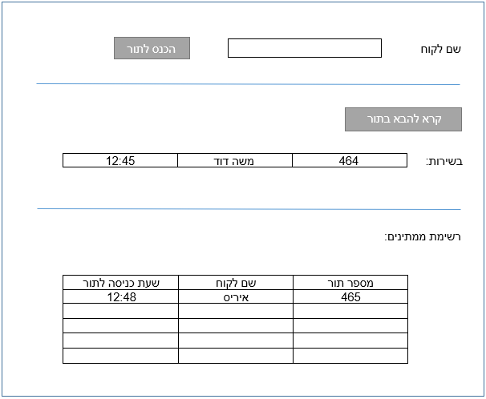

# Q-Nomy

Q-Nomy home assigment

עליך ליצור עמוד אינטרנט שבו כל משתמש יכול להכניס לתור, לקרוא לממתין ולצפות ברשימת הממתינים.
העמוד צריך להיראות באופן הבא:

כל הרשומות ישמרו בDB לפי סטטוס הפניה הנוכחי שלהם:
סטטוס ממתין: 0
סטטוס בשירות: 1
סטטוס הושלם טיפול: 2
* 	הקריאה להבא בתור תהיה בתצורת FIFO.
* 	לא תתאפשר הכנסה אנונימית לתור.
* 	מבנה הטבלאות והנתונים נתון לשיקול דעתך.
3 הגישה לבסיס הנתונים תיעשה דרך web service/Web API.

### Prerequisites

#### Local development

1. [Angular 9+](http://angular.io/)
2. [.NET Core 3.1](https://dotnet.microsoft.com/download)
3. [MsSQL Server Express 2017 Express](https://www.microsoft.com/en-us/sql-server/sql-server-downloads)

Everything used with default settings without additional installation. Just simple Next, Next, Next should be fine

#### Demo

1. [Docker](https://www.docker.com/)
2. [Docker Compose](https://docs.docker.com/compose/install/)

### Remarks

* For some strange reason I personally run into this issue: [Failed to start 'npm': Ensure that 'npm' is installed and can be found in one of the PATH directories](https://github.com/dotnet/aspnetcore/issues/18201) and most of the solutions failed to resolve [Stackoverflow](https://stackoverflow.com/questions/59367072/failed-to-start-npm-ensure-that-npm-is-installed-and-can-be-found).
So I devided this project to 2: Client (Angular) and Server (.NET Core only WebAPI)

### Demo

1. Clone this git repostiory: `git clone https://github.com/jasper22/Q-Nomy.git`
2. Enter into \Q-Nomy folder
3. Run `docker-compose build`	It should success building without eny errors, pull images, compile, etc..
3. Run `docker-compose up`		It should start all containers, update database, etc...
4. Open [http://localhost:85](http://localhost:85/)
5. Enjoy :yum:

### Demo (everything in one container)

1. Clone this git repostiory: `git clone https://github.com/jasper22/Q-Nomy.git`
2. Enter into \Q-Nomy folder
3. Run `docker build . --file one-container.Dockerfile --tag one-container:1.0` to build image with version 1.0
4. Run `docker run --rm -it  -p 6001:6001 -p 8081:80/tcp one-container:1.0` to run container
   * WebAPI project will listen on port 6001
   * Angular (frontend) project will listen on port 80
5. Open your browser at: [http://www.localhost:8081/](http://www.localhost:8081/)
6. Enjoy :yum:

### Local development

1. Clone this git repostiory: `git clone https://github.com/jasper22/Q-Nomy.git`
2. Enter into Q-Nomy\src\client and install all Angular packages: `npm install`
3. Restore all dotnet core packages by running: `dotnet restore QNomy.sln` in root folder of git repository
4. Review SQL connection string at: `Q-Nomy\src\server\appsettings.json`. Currently it points to default location of default installation of SQL Server Express. Make changes if you need
5. If you don't have Microsoft Entity Core 3.1 Tools installed you can install it in Powershell by running command: `Install-Package Microsoft.EntityFrameworkCore.Tools` from Administrative prompt
	* In Visual Studio 2019 it's already pre-installed and you could run those command from 'Package Manager' window
	* More information is here: [Entity Framework Core tools reference - Package Manager Console in Visual Studio](https://docs.microsoft.com/en-us/ef/core/miscellaneous/cli/powershell)
6. Update/Install database by running: `Update-Database` 
7. Once all this completes sucsesfully you are ready to run this client/server application

### Kuberentes local development

Check this tutorial: [kuberentes/minikube install and configuration](kuberenetes-minikube.md)

### Running

1. Enter into `Q-Nomy\src\server` folder and run the server by command: `dotnet run`. Server should start and listening on http://localhost on port 6287 
2. Enter into `Q-Nomy\src\client` folder and start the client app by running `npm start`. Once client is started navigate your browser to: [http://localhost:6286/](http://localhost:6286/)

### Additional notes :hammer:

1. Application should be translated to Hebrew as in original Q-Nomy request
2. More tests should be added to `QNomy.Test` project
3. Resolve strange issue when Angular and WebAPI could not be started both from VS 2019
4. :heavy_check_mark: ~~Dockerize both project + SQL server~~
