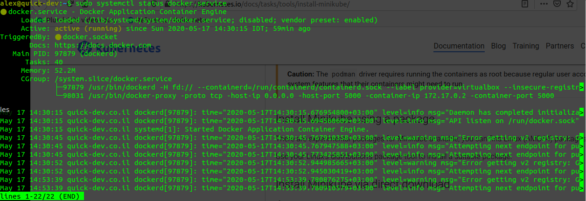

# Kebernetes (minikube) installation process

## Linux install

Follow the process described here [Minikube installation](https://kubernetes.io/docs/tasks/tools/install-minikube/) that basically boils down to this command:


```bash
curl -Lo minikube https://storage.googleapis.com/minikube/releases/latest/minikube-linux-amd64 \
  && chmod +x minikube
  
sudo mkdir -p /usr/local/bin/
sudo install minikube /usr/local/bin/
```

Please note: I'm using [VirtualBox](https://www.virtualbox.org/) as a driver for minikube - so download if necessary or use your other: [Minikube drivers](https://minikube.sigs.k8s.io/docs/drivers/)

## Setup local Docker registry

1. Create alias for docker registry. I choose `docker.local` but it can be anything. So - we edit `/etc/hosts` file and it should look like this:

    ```bash
    127.0.0.1	localhost
    127.0.0.1	docker.local    # <------ here we added it

    # The following lines are desirable for IPv6 capable hosts
    ::1     ip6-localhost ip6-loopback
    fe00::0 ip6-localnet
    ff00::0 ip6-mcastprefix
    ff02::1 ip6-allnodes
    ff02::2 ip6-allrouters
    ```

    Save and close `/etc/hosts` file


2. Find out where local docker config file stored

    ```bash
    sudo systemctl status docker.service
    ```

    you should get an output similar to this:

    

    Please note that docker systemctl file loaded from (in the second line where it says: Loaded ...):  

    >Loaded: loaded (**/lib/systemd/system/docker.service;** disabled; vendor preset: enabled)

    *You could have a different location/path*  


  so we edit this file with `sudo` privileges:

   1. Stop docker: `sudo systemctl stop docker.service`
   2. Edit: `sudo vi /lib/systemd/system/docker.service`

   Find the line that says: `ExecStart=.....` and append to it: `--insecure-registry docker.local:5000 --insecure-registry 192.168.1.3:5000 --insecure-registry 10.0.0.0/24`

  * We added `docker.local:5000` as insecure (not HTTPS) docker registry
  * We added the same registry but as edge IP address. My computer has local address: 192.168.1.3 but you should check your address
  * We added future minikube/kubernetes docker registry address at: 10.0.0.0/24 range (**before we started the minikube/kubernetes**)


  File should look like this:
    
   ```bash
    [Unit]
    Description=Docker Application Container Engine
    Documentation=https://docs.docker.com
    BindsTo=containerd.service
    After=network-online.target firewalld.service containerd.service
    Wants=network-online.target
    Requires=docker.socket

    [Service]
    Type=notify
    # the default is not to use systemd for cgroups because the delegate issues still
    # exists and systemd currently does not support the cgroup feature set required
    # for containers run by docker
    #ExecStart=/usr/bin/dockerd -H fd:// --containerd=/run/containerd/containerd.sock
    ExecStart=/usr/bin/dockerd -H fd:// --containerd=/run/containerd/containerd.sock --label provider=virtualbox --insecure-registry docker.local:5000 --insecure-registry 192.168.1.3:5000 --insecure-registry 10.0.0.0/24

    # Start docker registry
    #ExecStartPost=sleep 2s && /usr/bin/docker run -d -p 5000:5000 --restart=always --name registry registry:2
   ```

... cutted here for brevity ...


  Restart `systemctl` for `docker.service`
  1. `sudo systemctl daemon-reload`   to pick-up new configuration of Unit
  2. `sudo systemctl start docker.service`

Now local docker should start and automatically create local repository at `localhost:5000`. 

Check with `ss` command: `sudo ss -tunap | grep 5000`. The output should say something like:

```bash
tcp    LISTEN      0       4096        *:5000       *:*         users:(("docker-proxy",pid=98031,fd=4))
```

That's mean `docker-proxy` listening on this address and successfully created local registry !

More information here: [Deploy a registry server](https://docs.docker.com/registry/deploying/)


### Example of working with local registry

1. Pull latest .NET Core SDK 
    `docker pull mcr.microsoft.com/dotnet/core/sdk:3.1`
2. Tag it to local registry
    `docker tag mcr.microsoft.com/dotnet/core/sdk:3.1 docker.local:5000/mcr.microsoft.com/dotnet/core/sdk:3.1`
3. Push it to local registry
    `docker push docker.local:5000/mcr.microsoft.com/dotnet/core/sdk:3.1`

That's it - now this image is in local docker registry and will be pulled/used locally but only with this name: `docker.local:5000/mcr.microsoft.com/dotnet/core/sdk:3.1`

  Check it:
  1. Remove image
    `docker rmi docker.local:5000/mcr.microsoft.com/dotnet/core/sdk:3.1`
  2. Pull it locally
    `docker pull docker.local:5000/mcr.microsoft.com/dotnet/core/sdk:3.1`
  3. Voila ! :)


## Start minikube

There's a lot of options to start minkube. Here is mine:

```bash
/usr/local/bin/minikube start --driver="virtualbox" --host-dns-resolver=true --memory='8g' --nodes=1 --cpus=6 --dns-proxy=true --insecure-registry="docker.local:5000"
/usr/local/bin/minikube addons enable dashboard
/usr/local/bin/minikube addons enable ingress
/usr/local/bin/minikube addons enable ingress-dns
/usr/local/bin/minikube addons enable logviewer
/usr/local/bin/minikube addons enable metrics-server
/usr/local/bin/minikube addons enable registry
/usr/local/bin/minikube addons enable registry-aliases
```

*I starting it with 1 node that has 6 CPU's and 8 Gigabyte of memory. All other settings (ex: disk-size) is default*

\+ Started some addons for minikube

## Connect to minkube and change docker settings

1. Run `minikube ssh`
2. Check where docker.service file located as we did above:
    `sudo systemctl status docker.service`
3. Stop `docker` service: `sudo systemctl stop docker.service`
4. Edit this file: `sudo vi /usr/lib/systemd/system/docker.service`
5. At the same line that start with: `ExecStart=...` append: `--insecure-registry 192.168.1.3/24 --insecure-registry docker.local:5000`

So now the file should look like this:

```bash
[Unit]
Description=Docker Application Container Engine
Documentation=https://docs.docker.com
After=network.target  minikube-automount.service docker.socket
Requires= minikube-automount.service docker.socket
                                                      
[Service]
Type=notify
                                                      
# This file is a systemd drop-in unit that inherits from the base dockerd configuration.
# The base configuration already specifies an 'ExecStart=...' command. The first directive
# here is to clear out that command inherited from the base configuration. Without this,
# the command from the base configuration and the command specified here are treated as
# a sequence of commands, which is not the desired behavior, nor is it valid -- systemd
# will catch this invalid input and refuse to start the service with an error like:
#  Service has more than one ExecStart= setting, which is only allowed for Type=oneshot services.

# NOTE: default-ulimit=nofile is set to an arbitrary number for consistency with other
# container runtimes. If left unlimited, it may result in OOM issues with MySQL.
ExecStart=
ExecStart=/usr/bin/dockerd -H tcp://0.0.0.0:2376 -H unix:///var/run/docker.sock --default-ulimit=nofile=1048576:1048576 ---tlsverify --tlscacert /etc/docker/ca.pem --tlscert /etc/docker/server.pem --tlskey /etc/docker/server-key.pem --label provider=virtualbox --insecure-registry 10.96.0.0/12 --insecure-registry 192.168.1.3/24 --insecure-registry docker.local:5000

ExecReload=/bin/kill -s HUP
                                                                                                                                           
# Having non-zero Limit*s causes performance problems due to accounting overhead
# in the kernel. We recommend using cgroups to do container-local accounting.
```
... cutted here for brevity...

So this docker configuration define 3 insecure registry's:
   * `10.96.0.0/12` - This is default kubernetes registry address (it was here already)
   * `192.168.1.3/24` - this is we added as an address of my computer
   * `docker.local:5000` - this is again an address in my computer that we created above

Now - save this file and exit back to shell.

6. Start docker service: `sudo systemctl start docker.service`
7. Check that it running: `sudo systemctl status docker.service`
8. Check what images we have inside minikube now:

    `docker images`  

    The list should be something like this:

    ```bash
    $ docker images
    REPOSITORY                                                       TAG                 IMAGE ID            CREATED             SIZE
    docker.local:5000/clientapp                                      1.0                 c9b9b1714f29        3 hours ago         129MB
    quay.io/kubernetes-ingress-controller/nginx-ingress-controller   0.32.0              70144d369cb2        2 weeks ago         327MB
    alpine                                                           3.11                f70734b6a266        3 weeks ago         5.61MB
    kubernetesui/dashboard                                           v2.0.0              8b32422733b3        3 weeks ago         222MB
    k8s.gcr.io/kube-proxy                                            v1.18.2             0d40868643c6        4 weeks ago         117MB
    k8s.gcr.io/kube-scheduler                                        v1.18.2             a3099161e137        4 weeks ago         95.3MB
    k8s.gcr.io/kube-controller-manager                               v1.18.2             ace0a8c17ba9        4 weeks ago         162MB
    k8s.gcr.io/kube-apiserver                                        v1.18.2             6ed75ad404bd        4 weeks ago         173MB
    quay.io/rhdevelopers/core-dns-patcher                            latest              1ed6681318a5        7 weeks ago         129MB
    k8s.gcr.io/pause                                                 3.2                 80d28bedfe5d        3 months ago        683kB
    k8s.gcr.io/coredns                                               1.6.7               67da37a9a360        3 months ago        43.8MB
    registry.hub.docker.com/library/registry                         2.7.1               708bc6af7e5e        3 months ago        25.8MB
    cryptexlabs/minikube-ingress-dns                                 0.2.1               2a2abf12e45e        5 months ago        163MB
    jettech/kube-webhook-certgen                                     v1.2.0              b7f5a2787829        6 months ago        49MB
    k8s.gcr.io/etcd                                                  3.4.3-0             303ce5db0e90        6 months ago        288MB
    kubernetesui/metrics-scraper                                     v1.0.2              3b08661dc379        6 months ago        40.1MB
    k8s.gcr.io/metrics-server-amd64                                  v0.2.1              9801395070f3        2 years ago         42.5MB
    gcr.io/k8s-minikube/storage-provisioner                          v1.8.1              4689081edb10        2 years ago         80.8MB
    gcr.io/google_containers/kube-registry-proxy                     0.4                 60dc18151daf        3 years ago         188MB
    ```

    and you can see the image `docker.local:5000/clientapp` that I build on my machine and pushed it to local `docker.local:5000` registry. Now those images visible from minkube docker registry also.

    8. Exit minikube ssh - just type `exit` on command prompt and you should return to your machine.


## Using images in Deployments, Services, etc...

  When you define container path in your Service, Deployment, etc.. YAML file define it like this:

```yaml
apiVersion: apps/v1
kind: Deployment
metadata:
labels:
    ...
name: ...
spec:
replicas: 1
selector:
    matchLabels:
    ...
strategy: {}
template:
    metadata:
    labels:
        ...
    spec:
    containers:
    - image: docker.local:5000/webapi:1.0
        imagePullPolicy: "Always"
        name: ...
        ports:
        - containerPort: ...
        - containerPort: ...
    restartPolicy: Always
    serviceAccountName: ""
    volumes: null
status: {}    
```

So container name defined exactly as we `tagged` it before pushed to local docker registry.

That's it ! :)

Now minkube docker registry pointing to my local machine custom docker registry.

*Note:* Because we changed local `docker.service` file the local registry will be automatically started when computer reboots but sadly settings in minikube are lost when minikube started/stopped :(